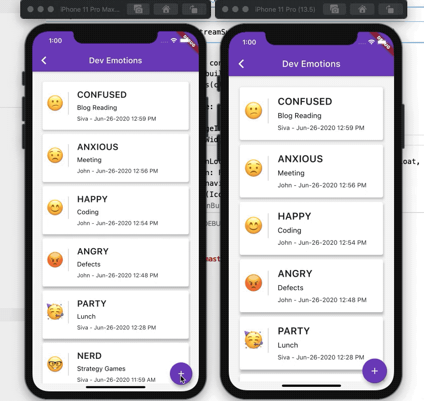

# 💙 Flutter Apps Powered by GraphQL with Hasura 😈

Developer Emotion Tracker - Application built with Flutter powered by GraphQL with Hasura & Postgresql. This application helps to track the emotion in developer's activities. 

Slides are here: https://slides.com/sivamuthukumar/flutter-graphql-hasura/

## Getting Started

To get started with Flutter, view Flutter's [online documentation](https://flutter.io/docs), which offers tutorials, samples, guidance on mobile development, and a full API reference.

## Setup Hasura GraphQL Server

Please visit the [Hasura documentation](https://hasura.io/docs/1.0/graphql/manual/index.html) to setup the Hasura GraphQL engine locally using docker or deploy in heroku with postgresql.

## Demo

